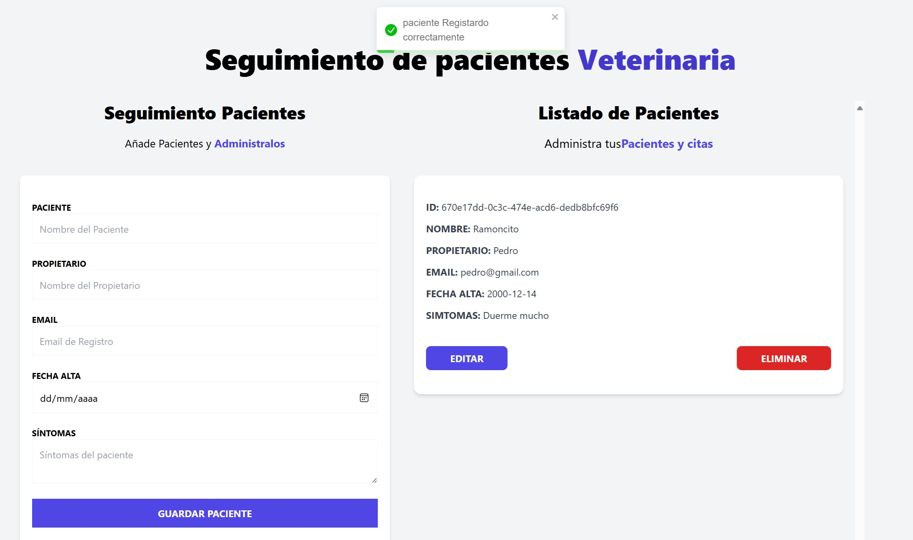

# Pacientes Veterinaria

Aplicación diseñada para gestionar el control de pacientes en una clínica veterinaria. Los datos se ingresan a través de un formulario, que es validado utilizando React Hook Form, permitiendo también la visualización de posibles errores. La información ingresada se muestra en una lista, junto con los botones para Editar y Eliminar, lo que facilita la manipulación de los registros. Cada acción, ya sea agregar, editar o eliminar, genera una notificación mediante 'react-toastify' para confirmar la operación. El manejo de las acciones y el estado global se gestiona con Zustand, y los identificadores de los registros se generan mediante uuid.
## Vista previa del proyecto

